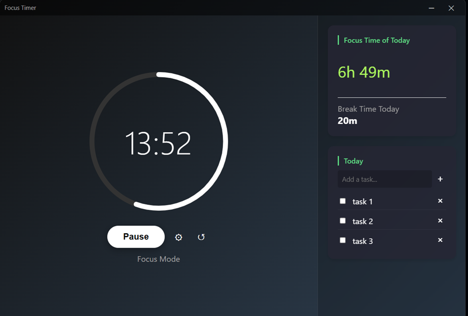

# Focus Timer (Rust)



A modern, desktop-based focus timer application built with Rust and Dioxus. This application helps you manage your time using the Pomodoro technique, tracking your focus sessions and breaks with a clean, unobtrusive interface.

## Featuresw

- **Focus & Break Timer**: Default 25-minute work sessions and 5-minute breaks (customizable). Includes overtime counting if you continue working past the timer.
- **Visual Progress**: Circular progress indicator for easy time visualization.
- **Smart Controls**: 
  - **Start/Pause**: Toggle timer state.
  - **Reset**: Quickly restart the current session.
  - **Overtime**: Continues counting up after the timer reaches zero until you interact.
- **Daily Statistics**: 
  - **Focus Time of Today**: Total duration spent in focus mode.
  - **Break Time Today**: Total duration spent on breaks.
- **Task Management**: 
  - **Today's Tasks**: Add, complete (toggle), and remove tasks directly from the sidebar.
  - **Hide Completed**: Option to filter out finished tasks.
- **System Tray Support**: Minimizes to the system tray to keep your taskbar clean while running in the background.
- **Native Notifications**:
  - **Windows**: Interactive Toast notifications (Start next session directly from notification).
  - **macOS**: Native system notifications.
- **Auto-Start**: Option to launch automatically on system startup.
- **Cross-Platform**: Fully supported on **Windows** and **macOS**.

## Tech Stack

- **Language**: Rust
- **UI Framework**: [Dioxus](https://dioxuslabs.com/) (HTML/CSS/Rust)
- **Async Runtime**: Tokio
- **Platform Integration**: `tray-icon`, `notify-rust`, `tauri-winrt-notification` (Windows), `winreg` (Windows Registry).

## Setup
Download the zip from https://github.com/aianau/focus-timer-rust/releases and unzip it anywhere you want.
Execute focus-timer-rust.exe on Windows or focus-timer-rust on macos. 
Enjoy.

## Building from Source

### Prerequisites

- [Rust Toolchain](https://rustup.rs/) (cargo, rustc) installed.

### Development

To run the application in development mode:

```bash
cargo run
```

### Building for Release

To build an optimized release version:

```bash
cargo build --release
```

The executable will be located in:
- **Windows**: `target/release/focus-timer-rust.exe`
- **macOS**: `target/release/focus-timer-rust`

**Note**: The application requires the `assets` folder (containing styles and icons) to be in the same directory as the executable, which is taken care of by the `build.rs` file at build time. 

### Packaging (Manual)

If you move the executable, ensure you copy the `assets` directory with it:

```
/MyTimerApp
  ├── focus-timer-rust.exe  (or focus-timer-rust on macOS)
  └── assets/
       ├── style.css
       └── timer-svgrepo-com.svg
```

## Configuration

Settings are saved automatically to `focus_timer_config.json` in the application directory. You can configure:
- Work duration
- Break duration
- Notification style (Persistent/Transient/Popup Window)
- Window size
- Startup behavior

